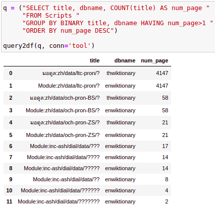
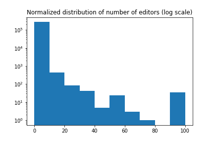
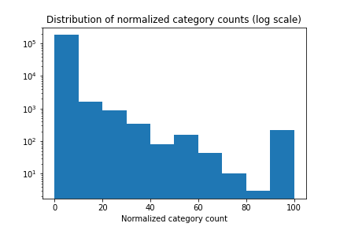
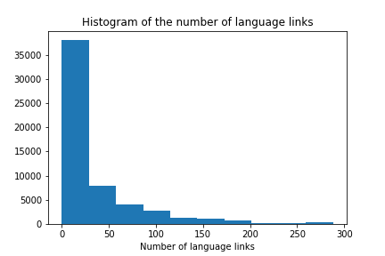
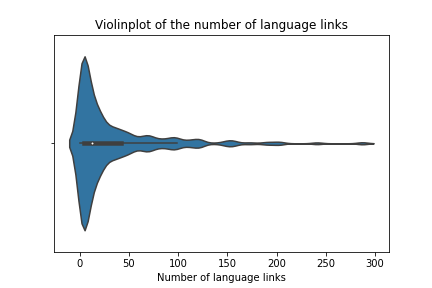
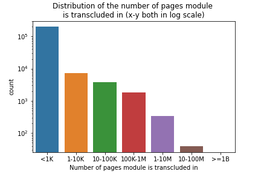
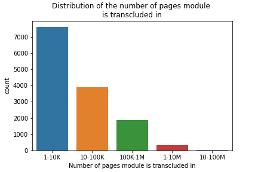
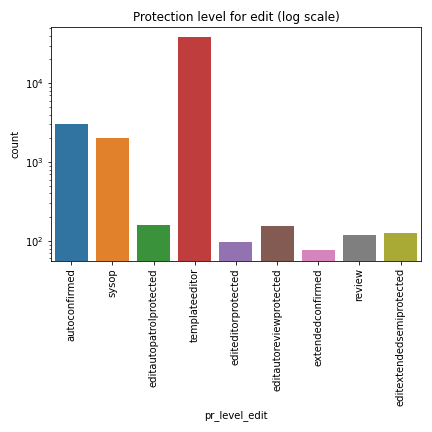
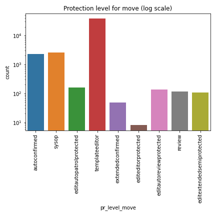
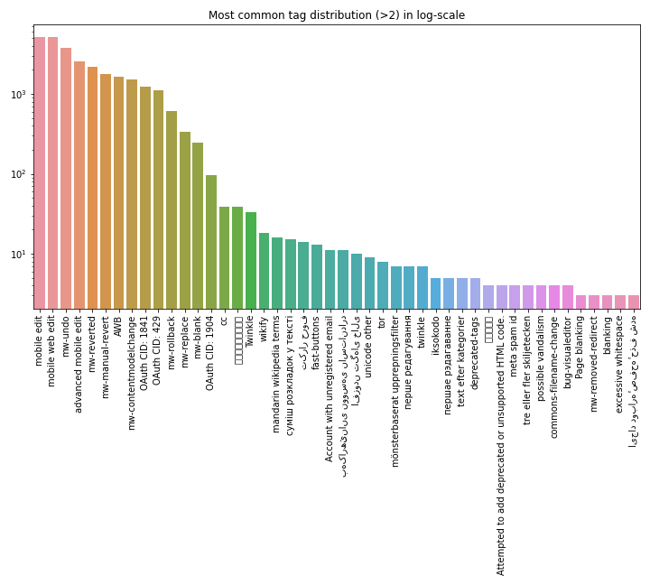

# Data Analysis Results

Determining priority Scribunto modules to centralize in Abstract Wikipedia

## Data collection

The source code of the Scribunto modules along with some additional data were collected using [mediawiki API](https://www.mediawiki.org/wiki/API:Main_page) and [databses](https://www.mediawiki.org/wiki/Manual:Database_layout). A list of the various data collected is given below:

| field           | description                   | field            | description                                                 |
| --------------- | ----------------------------- | ---------------- | ----------------------------------------------------------- |
| page_id         | ID of the page                | iwls             | Number of interwiki links from this module                  |
| title           | Page title                    | pls              | Number of page links from this module                       |
| dbname          | Database in which the page is | langs            | Number of language links of this module                     |
| url             | URL of the page               | transcluded_in   | Number of pages it is transcluded in                        |
| sourcecode      | Lua code of the module        | transclusions    | Number of modules this module transcludes                   |
| touched         | When was it last modified     | categories       | Number of categories it is part of                          |
| length          | Length of the code in bytes   | pr_level_edit    | Protection level for edits                                  |
| edits           | Number of edits               | pr_level_move    | Protection level for move                                   |
| minor_edits     | Number of minor edits         | tags             | Comma separated list of most common tags of this page       |
| first_edit      | Date of first edit            | tag_count        | Number of times most common tag appears                     |
| last_edit       | Date of last edit             | pageviews        | Sum of page views for all pages that transclude this module |
| anonymous_edits | Number of anonymous edits     | page_is_redirect | Is it a redirect page                                       |
| editors         | Number of contributors        | page_is_new      | Is it a new page                                            |

## Data Analysis

Most of the collected data were analysed and some heuristics were drawn from it to identify which modules could be more important than others. There were **~27.5k** modules with 12k new pages and only 1 redirect. enwiktionary, thwiktionary, frwiki, enwiki, plwiki databases were the top 5 with the most number of modules.

A field by field analysis is given below.

 
 
 
 
 

## Page title

Page title says a lot about what the module is about but based on the title some kinds of pages can be isolated as well. There were around **4k** modules that contained the string `sandbox` and **1.5k** with the string `user:`. These are testing modules and things users were experimenting with, so they are probably not modules important to be centralized and may even be deleted or obsolete in some cases. Removing these from analysis also can reduce the amount of comparisons we need to perform during code similarity analysis for example.

Page titles are usually unique in each project (and so database) but some page titles seemed to have repetitions. For example:

| page_id | page_title                  | database     |
| ------- | --------------------------- | ------------ |
| 6548045 | Module:inc-ash/dial/data/?? | enwiktionary |
| 7663284 | Module:inc-ash/dial/data/?? | enwiktionary |
| 7687663 | Module:inc-ash/dial/data/?? | enwiktionary |

Doing a groupby to get count of all duplicate pages:

This happens only in enwiktionary and thwiktionary. Peeking at the sourcecode reveals that their codes are in fact different but contains `???`. These are some characters that were not rendered properly and can also be verified from [here](https://en.wiktionary.org/wiki/Module:inc-ash/dial/data/%F0%91%80%AD%F0%91%80%B8%F0%91%80%9A%F0%91%80%B8).
 
 
 

## Numeric data

I calculated the average of edits per contributor and the average number of edits per day for each page to get an idea of how much or how frequently a module was being edited. Besides other columns were also used as is. The common pattern in _all_ the fields is that 99% of the values are very small. Only the outliers are then left to analyse, which are a lot too. This will become clearer from the discussions below.

 
 
 
 

## Number of editors

For each page we collect the total number of unique logged-in editors till date. When all wikis are thought of together, a cutoff of 20 seems to separate the extreme outliers well. Modules with more than 20 editors can be important.

  
   
  

Since the size of each wiki is different, the numbers of editors, edits etc determines the importance different wikis at different levels, it is not a good idea to compare enwiki with a very small wiki for example. So we calculate the normalized version of the edits.
After normalization by database the 99th quantile is ~0.4, i.e **99% of the pages have edits less than 0.4% of the total number of edits in that respective project**. In this case 5% seems like a nice cutoff, pages with more than 5% editors can be considered quite important.

  
   
  

There are pros and cons to this approach:

- For big wikis, pages with very high number of editors could be ignored because there are other pages in that wiki with even higher number of editors
- For smaller wikis, pages with very small number of editors (< 5) can become priority because the entire wiki has editors in that magnitude itself. That is why there seem to be more dots near `100` in the graphs above.
   
   
   
   
   

## Number of edits

Total count of the edits till date for each page is analysed. Similar to before, both original counts and normalized counts are to be considered. For pure edit counts, pages having greater than 300 edits are less common and can be considered for centralization.

  
   
  

**Major edits**: Although number of edits give outliers, this count includes both major and minor edits. To make our analysis more reliable, we can instead look at major edits only. In this case also, 300 seems to be a nice cut-off to the number of major edits to consider.

  
   
  

**Normalized major edits**: Since each wiki has widely different number of pages, and so naturally different magnitude of the number of edits, it makes sense to normalize them with the total number of edit per project or wiki. Such normalization can reflect wikis of similar magnitude more accurately, but comparing the largest and the smallest wiki with this approach is a bit overkill. That is because the super-small wikis may have only a few total edits, which will shine out alongside the _highly_ edited pages in bigger wikis. Nevertheless, if we consider normalization, pages with greater than 15% major edits are worth a look.

  
   
  

**Number of anonymous edits**:

Although high number of anonymous edits may not definitively mean a module is more important, it surely is worth peoples attention. So they could considered be for further analysis if required.

  
   
  

N.B: To get the edits that are major _and_ from logged-in users, data needs to be collected again with these conditions. We cannot do `edits - minor_edits - anonymous_edits` as it may deduct the minor anonymous edits twice (which I would guess are the most among the anonymous edits)

## Average number of edits per contributor

99th percentile is `5`. There are too many outliers as seen from the plot, yet 150-200 seems like a good cutoff. Pages with greater than 200 contributions per editor stuck out and may be given priority.

  
   
  

Note: Those with values > 200 need to be further analysed to remove contribution of bots and merge multiple frequent contributions together. For example all contributions of 1 person within 5 minutes can be considered as 1 contribution.

## Average number of contributions per day

In this case 6k seems like a nice cutoff to separate frequently edited modules. We can reduce it upto 3.5k-4k if we want to accommodate more modules to be merged/prioritized.

  
   
  

Note: These need to be further analysed to merge multiple frequent contributions together as they produce extreme values.
 
 
 
 
 
 

## Length

Length of a module hardly makes a module important. But I noticed that data modules tend to be lengthy. Some data could be critical usage but that can be understood from other data like transclusions or pageviews. For now, the length can be used to find codes that might incorporate large amount of data in them.

  
   
  

## Number of pagelinks

Pagelinks indicates places where a page was linked 'within' that wiki project and language (i.e within a database). Modules that were linked in many places may indicate they are being talked about a lot or referenced a lot. This may provide a pseudo measure of module importance. For raw pagelink counts cutoff is 1500, for normalised pagelinks it is 20%.

  
   
  

  
   
  

## Number of Categories

This feature is a little less reliable in that not all modules are always included in categories. But those that do have categories may be prioritized over those that don't. Being included in higher number of categories may not always mean a module is more important. Some modules were included in lots of categories but all those categories actually turned out to be very related.

  
   
  

To normalize the category counts, the total number of categories per database was taken. Only the categories that had any module in it were counted. And raw category count per module was divided by that.

## Number of Language links

If a module has it's copies in multiple languages it is quite possible that it is widely used and so important. Those with lots of language links therefore can be considered important. Those with above 100 language versions may be worth extra attention.

 

Ideally if a module has `n` langlinks there should be `n` pages with `n` langlinks at the least. When I looked for langlinks of a page in our database I could not find them all. For example there is only 1 module with 126 langlinks, only 2 modules with 103 langlinks etc. Given that these modules have the highest langlinks they would have been considered priority for centralizing.

- Looking for them in page table I found they were `wikitext` and from namespaces other than `828` (which is why they were not in our database)
- Looking at their source seems like those marked Scribunto are infact Lua while those marked wikitext are not Lua.

Conclusion: langlinks are `across` content models like Scribunto, wiktext. i.e. If a module has 89 language links does not mean the other 89 pages are Scribunto modules.

## Transcluded in

Lua modules are functions that are used in wiki pages using `#invoke`. The wiki is said to transclude that module. Finding out the number of pages that transclude a module can tell us how often it is used and so if it is important to centralize. Raw count of the number of pages a module is trancluded in greater than 1 million is quite unique. Normalizing it per database we see that greater than 15% is a good number to isolate important modules.

  
   
  

 

  
   
  

 
 
 
 
 
 
 
 
 
 

## Transclusions

Sometimes the modules themselves transclude other modules. Analyzing which modules are connected to which ones can help us inter-module relationships. We could find which are more dependent (and so have more transclusions). Meaning, if most of its dependencies are centralized, it may be recommended for centralizing too.

  
   

Most modules have less than 30 transclusions. Some observations:

- Those with the most transclusions are transcluded in very less pages
- Too many transclusions does not really mean it very important, it just seems to use a lot of similar data (like ISO data)
- Those with average amount of modules transcluded are transcluded in high number of pages
- Modules with avg to high transclusions actually transclude only modules highly relevant to itself. To find dependent modules, we need to find modules that transclude modules that are not too related to each other.
- Those with only few transclusions are transcluded in lots of pages.

## Protection levels

Protection level of pages can give us a good sense of how critical some of the modules are. There are 4 basic levels of page protections ([protection policy](https://en.wikipedia.org/wiki/Wikipedia:Protection_policy)):

- **Semi-protection** (autoconfirmed) prevents the action by unregistered contributors and contributors with accounts that are not confirmed.
- **Extended confirmed** (extendedconfirmed) protection, also known as 30/500 protection, prevents the action by users without 30 days tenure and 500 edits on the English Wikipedia.
- **Template protection** (templateeditor) prevents the action by everyone except template editors and administrators.
- **Full protection** (sysop) prevents the action by everyone except administrators.

Modules that are sysops and templateeditor protected are definitely important.
It may be a good idea to look at what are the extended confirmed modules, maybe quite important as well since they had to be moved from autoconfirmed to extendedconfirmed.

There are protections for two main activities: move and edit. In most cases the protection level of both activities are the same.

Besides these 4 values, some other are mentioned in the protection level column of databases. It seems those are user-rights and are used for newer pages. After studying about how user-rights are used I found out that user-rights lists are different for different wikis (Special:ListGroupRights lists them all). So as time goes on doing inter-wiki analysis of this section will become tough, but for now we can work with the 4 most common terms.

 

## Tags

Each edit in a page is sometimes associated with a tag. The tag can be about where it was edited from or associate the edit with a bot etc. Even pages with the highest number of edits may not have tags, so tags should not be used alone as a source of prioritizing modules. _14k modules out of 272k have tags_.

Since we cannot possibly work with every edit of every module, we collected only the most common tag of each module where that tag has appeared at least 5 times. Sometimes this gives us multiple tags.

All wikis seem independent in terms of what tags they could have. I have made a list of the ones I thought important from enwiki but ofcource these may not be applicable across all wikis, and other wikis may have other important ones. Although a quick scan through a few wikis shows that the ones I listed are probably used across all wikis.

Some tags seem to be same, but named in different language in different wikis. Like 'page was emptied', or 'too much text in other language' etc.

Tags that may be worth looking at for us:

- undo, revert, manual-revert, rollback maybe used to check what modules were being back and forth a lot
- replace/blank could be used to find pages that were actively being edited (note that the length of the content needs to be considered in this context because replace tag is set when 90% of contents are changed)
- place of edit: 'visualeditor-switched', 'mobile web edit', 'advanced mobile edit', 'mobile edit'

Although we did not collect it, number of reverts, mobile edits, blanks etc could be collected and checked if they seem important. Most tags appear as most-common-tag only in 1 or 2 pages, so those were excluded in the figure below.

