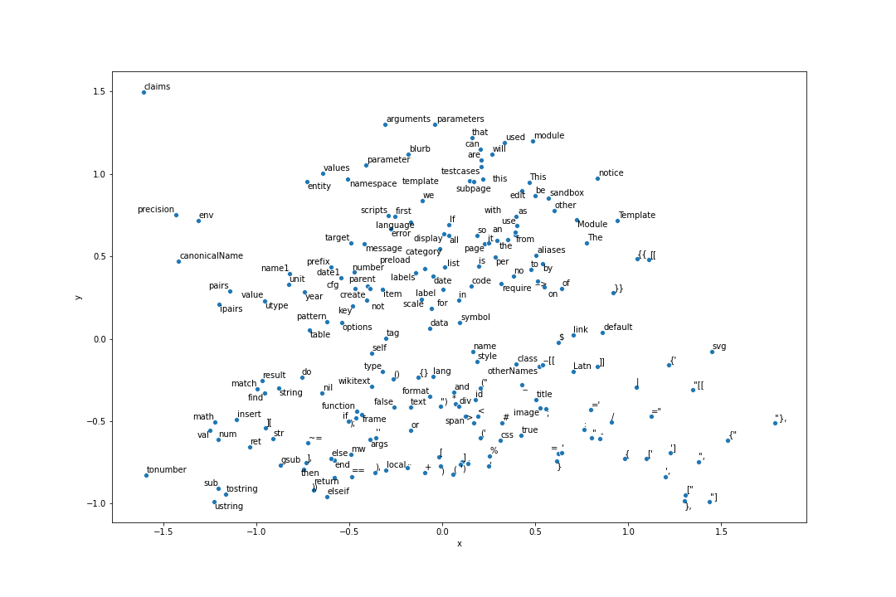
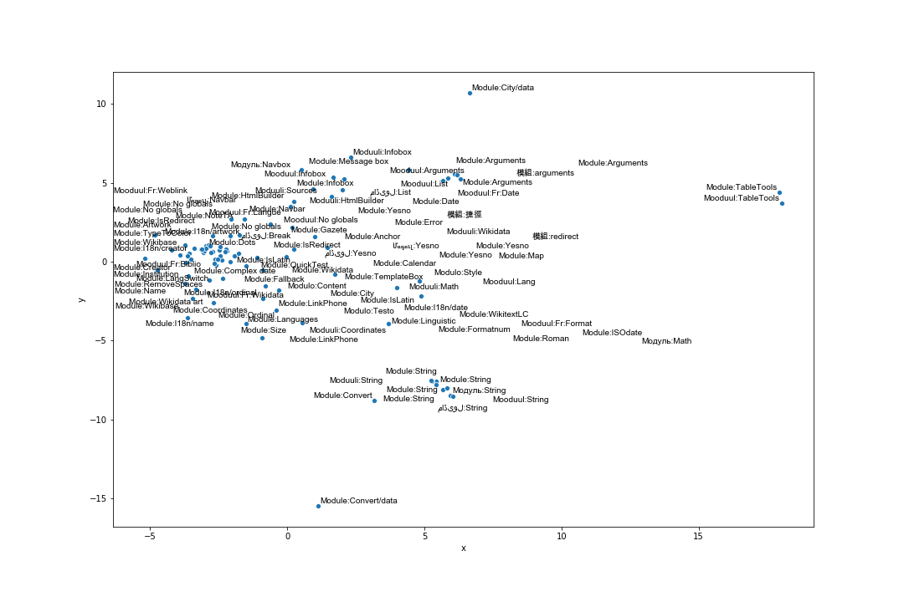

# Introduction

In the world of various wikimedia projects, Lua modules are used extensively to perform basic (calculate age, location) to more complex functions (rendering templates). With Abstract Wikipedia the aim is to consolidate knowledge in a language-independent way. The knowledge is rendered in any languages as required using the 'knowledge of language' stored in wikidata. To this end, the reservoir of Lua modules that we have scattered among wikis need to be gathered as well. In this project our aim was to find out which modules are more important to be merged first (priority detection [T272003](https://phabricator.wikimedia.org/T272003)) and what are the various modules similar to them (similarity detection), so that they can be merged.

# What is code similarity?

In our case we want to provide users with a list of modules that possibly perform the same functions across wikis and so can be merged into one for Abstract Wikipedia. Figuring out code functionality is hardly possible though computation, so we opt to search for code that 'look' similar and let users decide if they really do the same thing (they should do something similar atleast). We've experiemented with multiple ways to group modules together which I describe below. But first let's look at the types of modules available.

# Types of modules

Modules are not only functions but also places to store a bit of data, like list of pronounciations, longitude-latitude of places etc. Looking at the distribution of the length of modules, we see lots of modules with very large character count. On analysis we find that most of these are infact data modules and not some very large convoluted lua function. To find similar modules, we therefore separate data modules and include the option for users to view either all modules, or modules that are only functions.

Data modules were isolated in this task [T273767](https://phabricator.wikimedia.org/T273767).

# Clustering modules

To group modules we start with distance based analysis of modules and use those distances as features to perform clustering using various algorithms. Later distance based methods were found to be slow and requiring excessive memory (pair-wise distances require n^2 memory where n=300k modules). Considering code contains much overlap with regular text, we can find code pieces that look similar. So we train models to project modules in high-dimentional vectors and use these as features instead of the actual code to perform clustering. So there are mainly 2 things to choose: Features and Clustering algorithm. Brief description of the features and how they were used in various algorithms is given below.

## Features

1. **Levenshtein distance:** Levenshtein distance between two sequence is the minimum number of single-character edits (insertions, deletions or substitutions) required to change one word into the other ([Wkipedia](https://en.wikipedia.org/wiki/Levenshtein_distance)). Basically this distance can tell us how similar two modules are, and to normalize caracter counts we divide the count by the sum of lengths of the two modules. This distance matrix was then used as input to various clustering algorithms.

   `Lev(A,B) = Levenshtein_distance(A,B)/( Length(A) + Length(B) )`

   One idea was to use diffing (like in git). Analysing some plagarism detection algorithms I found that Levenshtein distance covers it already in a better way and the memory footprint for diffing is not any lower.

   Note: I also looked into using plagarism detector as a way to find similar codes but unfortunately none was found comptible for Lua codes.

2. **Levenshtein distance (dimentionality reduced with MDS):** Not all algorithms can take in raw distance matrixes. The traditional KMeans cannot, and so it is necessary to reduce the dimentionality of this matrix using MDS ([Multidimensional scaling](https://en.wikipedia.org/wiki/Multidimensional_scaling)). PCA is not suitable for distance matrices. Then the new matrix is used for clustering.

3. **Tf-idf:** [Td-idf](https://en.wikipedia.org/wiki/Tf%E2%80%93idf) is the most common method to represent any text in numeric form. For each token it calculates a value representing importance of the token in the corpus. tf-idf of tokens along with n-grams of tokens give better representation of the document to be used as feature.

4. **Word Embedding:** Word embeddings are high-dimentional vectors that represent each token and have values such that similar tokens are nearer in the vector space than un-related tokens. A word-embedding model (fasttext in our case) has to be trained only once and then vector representation of any word can be generated from the trained model. A representation of word embeddings in 2D plane is shown below, some similar words are seen nearby.

   

   Since it gives us an embedding for each token, the way to get embedding for the whole module can be one of two ways:

   - Averaged Embeddings: Average all word-embeddings, so it gives us a small vector for each module. Altough it sounds hacky, this method actually works for numerous text processing systems like document classification, sentiment analysis etc.
   - Concatenated Embeddings: Instead of averaging, all embeddings are concatenated together. This requires fixing a length for each module. Longer code is trucated, shorter ones are post-padded.

5. **Document Embedding:** Doc2Vec can be used to get a embedding for the whole document in one shot. This also is trained once and embedding for any document is generated on the go. A sample of doc2vec embedings reduced to 2 dimentions is plotted below with the module titles.

   

6. **Code Embedding:** So far text-analysis based methods have been used to numericalize Lua modules. Some models are available to project specifically 'codes' into a vector space (e.g [Code2Vec](https://code2vec.org/)). Unfortunately most available models are trained in populalar languages like Python, C++, Java etc. To train Lua codes in these models some time must be spent understanding and creating a `Lua extractor` which takes in raw Lua codes and uses ASTs of codes to produce input that the model can then take in. We have not ventured into these territories yet but a trained Lua Code2Vec can be beneficial for lots of other tasks as well. Something we can look into later.

## Clustering Algorithms

The most basic method to find similar modules would be - for each module, get a list of nearest modules. Nearest could mean least Levenshtein diatnces, or least eucledian or cosine distances of the embeddings. This would require us to compute the diatances of all modules for each module in runtime. This isn't feasible as O(n) on ~300k modules everytime is a bit much.

Using clustering we could store the cluster ids in database and get list of modules in the same cluster using those ids. The difference is that we get a limited number of modules instead of a list of all clusters in descending order of similarity. Getting a couple of related modules instead of all modules is enough for our case as users would not scroll through the entire list. Sometimes the clusters are too small, in that case other related clusters can be pointed out to the user to explore. Below the results of testing various suitable clustering algorithms for module similarity detection are described.

1. **KMeans:**

   - KMeans algorithm requires a parameter mentioning the number of clusters we want generated from the data (parametric). Given we do not know this before hand, the elbow method can be used to find the optimum number of clusters.
   - KMeans is a bit slower than the other methods mentioned below.
   - With large number of clusters (still small in comparison to the number of modules) easily runs out of memory.
   - On analysis with a subset of the modules (1k) reaveals that the modules in a cluster are not as correlated as we would like.

2. **DBSCAN:**

   - It does not require knowing the number of clusters before hand (non-parametric).
   - Running DBSCAN on subset of the modules show that it identifies a lot of the modules as noise. Others are divided among lots of small clusteres but the modules within each cluster are highly relevant.
   - DBSCAN from scikit-learn is optimized for speed, not memory. So it runs out of memory when running with all the modules.
   - The most important parameter in DBSCAN is `eps`, the maximum distance between two samples for one to be considered as in the neighborhood of the other (source: [sklearn docs](https://scikit-learn.org/stable/modules/generated/sklearn.cluster.DBSCAN.html)). Tuning this parameter has drastic effects yet the number of noise does not decrease, nor do the size of the clusters grow significantly (except for few clusters that grow too much).

3. **Affinity Propagation:**

   - Also non-parametric
   - Output worse than DBSCAN, almost all points as considered noise, 2-3 very large clusters, and the rest are single module clusters. Scenario does not change on tuning various parameters.
   - Not used for further testing due to output imbalance.

4. **Heirarchical Clustering:**

   - Non-parametric.
   - Results are similar to Affinity propagation, also not used further.
   - A bit slower.

5. **OPTICS:**
   - OPTICS works similar to DBSCAN but scikit-learn OPTICS is optimized for memory rather than speed. So it takes much longer to train all modules but fits in memory.
   - It does not have sensitive parameters like DBSCANs `eps`. It works dynamically on various eps values.
   - Output is similar to DBSCAN with well-defined clusters but lots of noise too. OPTICS is trained such that module relevancy is calculated and clusters are formed from these values. To reduce noise and merge smaller clusters these values can be used to customize clusters ourselves. Besides, the `xi` value can be tuned to change cluster sizes in general.

## Summary of pros and cons

All the features can be used with all the algorithms mentioned above but not all options are worth testing. Some techniques have patterns that can help us isolate the better method for us, like memory consumption, time taken, types of clusters formed etc. A brief table is shown with summary of the results. If the algorithm runs out of memory for all modules, the clustering analysis of 500-1k modules was given instead (as analysis was done on a small subset first).

| Feature                       | Clustering Algo      | Time                                                       | Memory                                                                                                         | clusters                                                                                                                                   |
| ----------------------------- | -------------------- | ---------------------------------------------------------- | -------------------------------------------------------------------------------------------------------------- | ------------------------------------------------------------------------------------------------------------------------------------------ |
| Levenshtein                   | dbscan               | instant                                                    | memory runs out with all modules (as Levenshtein creates nxn matrix )                                          | Lots of small clusters and too many noise detected                                                                                         |
| Levenshtein                   | affinity propagation | instant                                                    | -                                                                                                              | Most in 2-3 clusters, rest are individual clusters (size=1)                                                                                |
| Levenshtein                   | heirarchical         | instant                                                    | -                                                                                                              | Similar to affinity propagation                                                                                                            |
| Levenshtein                   | KMeans (after MDS)   | bit slow                                                   | memory runs out with large number of clusters                                                                  | Elbow method to find `number of cluster` parameter. Evenly sized clusters but modules within clusters are not highly realted               |
| Tf-idf                        | KMeans               | tfidf is really slow                                       | runs out of memory on tf-idf step for all data (estimated amount of memory required is too high >1000s of GBs) | Detects relevant clusters and cluster sizes are medium with only a few noise-clusters (cluster of all modules that dont fit anything else) |
| Tf-idf                        | DBSCAN               | tfidf is really slow                                       | runs out of memory on all data due to Tf-idf                                                                   | Better than Levenshtein DBSCAN but still a lot of noise                                                                                    |
| Word Embedding (FastText)     | KMeans               | Embedding all data takes 12 hours, but is a one time thing | memory runs out with large number of clusters-                                                                 | Clusters have long tail and arent as related either                                                                                        |
| Word Embedding (FastText)     | DBSCAN               | As above                                                   | Out of memory for all data                                                                                     | Lots of noise, clusters are highly related                                                                                                 |
| **Word Embedding (FastText)** | **OPTICS**           | As above plus takes long time for clustering               | Fits. Tradeoff with time.                                                                                      | Lots of noise, clusters sizes are moderate (on tuning). Noise can be reduced by tuning as well.                                            |
| Docement Embedding (Doc2Vec)  | OPTICS               | As above                                                   | Fits. Tradeoff with time.                                                                                      | More noise than fasttext version. Clusters are smaller in size and less in number. Tuning possible.                                        |

On comparison of the above methods the finalists were:

- Word embedding with DBSCAN algorithm: Produce ~12k clusters. Some noise also reported. Note that the number of modules is ~300k.
- Document embedding with DBSCAN algorithm: Produces around ~5k clusters. This methods produces more noise comparatively and reports some distinct clusters (as found from word embedding based model) as one cluster.

Therefore word embedding model is being used now. The script to train embedding and perform clustering supports both kinds of embdding, so it can be changed and tested anytime if required.

## Noise Removal and tuning

OPTICS algorithm has very little effect with parameter tuning (atleast for our case). The parameter `xi` decides how loosely connected samples can be in a cluster, effectievly changing the number of clusters and number of noise, although it doesn't vary drastically. Upon analysing the clusters manually `xi` value of `0.0005` was chosen. Below a few figures are shown with varying number of clusters with varying `xi` values 0.05(default), 0.005, and 0.0005 with word embedding based features.

  
   
   

It is to be noted that it is a density based clustering algorithm. Certain modules are bascially _copied_ across wikis to perform similar functions, or slightly changed. This creates very dense clusters that the algorithm detects. But the side effect is that modules similar to each other, but not almost exact matches fall outside the dense region. This makes those being marked as noise or separated into other clusters.

A TSNE plot (rendering high-dimentional vectors in 2D) is shown below for Doc2Vec-OPTICS with colors for different clusters. The blue markers are noise (as marked by the algorithm) and the rest are various clusters. The second image shows the same figure without the modules marked noise.

  
   

Thankfully sklearn OPTICS implemenation returns ordering and reachability distances which gives us a order in which if the modules are arranged, we can find related clusters and which cluster a noise is closest to. Using these information I was able to devise a way to remove noise from our application. For example, the noise in between cluster 2 and 3 can be marked as cluster 2.5 . Most often (not always) clusters marked 2.5 will be similar to each other and also similar to cluster 2 or 3 or both. This way we can provide more information to a user about nearby modules and explore similar clusters. Below a TSNE plot is shown (also with doc2vec-OPTICS) with noise and then after removing noise for 10k sample modules (generating TSNE for ~300k modules is time consuming and resource intensive).

  
   

